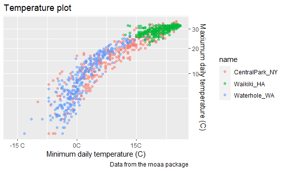

visualization2
================
Paulina Han
2021/10/7

``` r
library(tidyverse)
```

    ## -- Attaching packages --------------------------------------- tidyverse 1.3.1 --

    ## v ggplot2 3.3.5     v purrr   0.3.4
    ## v tibble  3.1.4     v dplyr   1.0.7
    ## v tidyr   1.1.3     v stringr 1.4.0
    ## v readr   2.0.1     v forcats 0.5.1

    ## -- Conflicts ------------------------------------------ tidyverse_conflicts() --
    ## x dplyr::filter() masks stats::filter()
    ## x dplyr::lag()    masks stats::lag()

``` r
library(ggridges)
library(hexbin)
library(viridis)
```

    ## 载入需要的程辑包：viridisLite

``` r
#global option for graph size
knitr::opts_chunk$set(
  fig.width = 6,
  fig.asp = .6,
  out.width = "99%"
)
```

``` r
#load the data I use very often
weather_df = 
  rnoaa::meteo_pull_monitors(
    c("USW00094728", "USC00519397", "USS0023B17S"),
    var = c("PRCP", "TMIN", "TMAX"), 
    date_min = "2017-01-01",
    date_max = "2017-12-31") %>%
  mutate(
    name = recode(
      id, 
      USW00094728 = "CentralPark_NY", 
      USC00519397 = "Waikiki_HA",
      USS0023B17S = "Waterhole_WA"),
    tmin = tmin / 10,
    tmax = tmax / 10) %>%
  select(name, id, everything())
```

    ## Registered S3 method overwritten by 'hoardr':
    ##   method           from
    ##   print.cache_info httr

    ## using cached file: C:\Users\lenovo\AppData\Local/Cache/R/noaa_ghcnd/USW00094728.dly

    ## date created (size, mb): 2021-10-05 10:34:44 (7.617)

    ## file min/max dates: 1869-01-01 / 2021-10-31

    ## using cached file: C:\Users\lenovo\AppData\Local/Cache/R/noaa_ghcnd/USC00519397.dly

    ## date created (size, mb): 2021-10-05 10:35:33 (1.701)

    ## file min/max dates: 1965-01-01 / 2020-02-29

    ## using cached file: C:\Users\lenovo\AppData\Local/Cache/R/noaa_ghcnd/USS0023B17S.dly

    ## date created (size, mb): 2021-10-05 10:35:54 (0.913)

    ## file min/max dates: 1999-09-01 / 2021-09-30

start with somthing easy

``` r
weather_df %>% 
  ggplot(aes(x = tmin, y = tmax, color = name)) + 
  geom_point( alpha = .5) + 
  labs(
    title = "Temperature plot",
    x = "Minimum daily temperature (C)",
    y = "Maxiumum daily temperature (C)",
    caption = "Data from the rnoaa package"
  )
```

    ## Warning: Removed 15 rows containing missing values (geom_point).


## Scales

``` r
weather_df %>% 
  ggplot(aes(x = tmin, y = tmax, color = name)) + 
  geom_point( alpha = .5) + 
  labs(
    title = "Temperature plot",
    x = "Minimum daily temperature (C)",
    y = "Maxiumum daily temperature (C)",
    caption = "Data from the rnoaa package"
  ) +
  scale_x_continuous(
    breaks = c(-15,0,15),
    labels = c("-15 C","0C","15C")
  ) +
  scale_y_continuous(
    trans = "sqrt",
    position =  "right"
  )
```

    ## Warning in self$trans$transform(x): 产生了NaNs

    ## Warning: Transformation introduced infinite values in continuous y-axis

    ## Warning: Removed 90 rows containing missing values (geom_point).



``` r
weather_df %>% 
  ggplot(aes(x = tmin, y = tmax, color = name)) + 
  geom_point( alpha = .5) + 
  labs(
    title = "Temperature plot",
    x = "Minimum daily temperature (C)",
    y = "Maxiumum daily temperature (C)",
    caption = "Data from the rnoaa package"
  )+
   scale_color_hue(name = "Location", h = c(100, 300))
```

    ## Warning: Removed 15 rows containing missing values (geom_point).


``` r
  weather_df %>% 
  ggplot(aes(x = tmin, y = tmax)) + 
  geom_point(aes(color = name), alpha = .5) + 
  labs(
    title = "Temperature plot",
    x = "Minimum daily temperature (C)",
    y = "Maxiumum daily temperature (C)",
    caption = "Data from the rnoaa package"
  ) + 
  scale_color_viridis_d(
    name = "Location"
  )
```

    ## Warning: Removed 15 rows containing missing values (geom_point).


## Theme

``` r
weather_df %>% 
  ggplot(aes(x = tmin, y = tmax)) + 
  geom_point(aes(color = name), alpha = .5) + 
  labs(
    title = "Temperature plot",
    x = "Minimum daily temperature (C)",
    y = "Maxiumum daily temperature (C)",
    caption = "Data from the rnoaa package"
  ) +theme_bw() + #black and white can only be used before theme
  theme(legend.position = "bottom")
```

    ## Warning: Removed 15 rows containing missing values (geom_point).


``` r
weather_df %>% 
  ggplot(aes(x = tmin, y = tmax)) + 
  geom_point(aes(color = name), alpha = .5) + 
  labs(
    title = "Temperature plot",
    x = "Minimum daily temperature (C)",
    y = "Maxiumum daily temperature (C)",
    caption = "Data from the rnoaa package"
  ) +
  theme_bw() +  #black and white can only be used before theme 
  theme_minimal()+
  theme(legend.position = "bottom") 
```

    ## Warning: Removed 15 rows containing missing values (geom_point).


