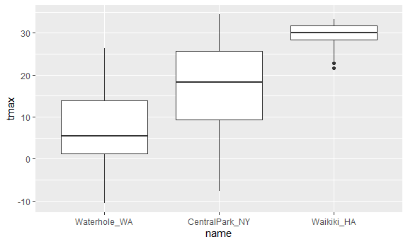

visualization2
================
Paulina Han
2021/10/7

``` r
library(tidyverse)
```

    ## -- Attaching packages --------------------------------------- tidyverse 1.3.1 --

    ## v ggplot2 3.3.5     v purrr   0.3.4
    ## v tibble  3.1.4     v dplyr   1.0.7
    ## v tidyr   1.1.3     v stringr 1.4.0
    ## v readr   2.0.1     v forcats 0.5.1

    ## -- Conflicts ------------------------------------------ tidyverse_conflicts() --
    ## x dplyr::filter() masks stats::filter()
    ## x dplyr::lag()    masks stats::lag()

``` r
library(ggridges)
library(hexbin)
library(viridis)
```

    ## 载入需要的程辑包：viridisLite

``` r
library(patchwork)
#global option for graph size
knitr::opts_chunk$set(
  fig.width = 6,
  fig.asp = .6,
  out.width = "99%"
)
```

``` r
#load the data I use very often
weather_df = 
  rnoaa::meteo_pull_monitors(
    c("USW00094728", "USC00519397", "USS0023B17S"),
    var = c("PRCP", "TMIN", "TMAX"), 
    date_min = "2017-01-01",
    date_max = "2017-12-31") %>%
  mutate(
    name = recode(
      id, 
      USW00094728 = "CentralPark_NY", 
      USC00519397 = "Waikiki_HA",
      USS0023B17S = "Waterhole_WA"),
    tmin = tmin / 10,
    tmax = tmax / 10) %>%
  select(name, id, everything())
```

    ## Registered S3 method overwritten by 'hoardr':
    ##   method           from
    ##   print.cache_info httr

    ## using cached file: C:\Users\lenovo\AppData\Local/Cache/R/noaa_ghcnd/USW00094728.dly

    ## date created (size, mb): 2021-10-05 10:34:44 (7.617)

    ## file min/max dates: 1869-01-01 / 2021-10-31

    ## using cached file: C:\Users\lenovo\AppData\Local/Cache/R/noaa_ghcnd/USC00519397.dly

    ## date created (size, mb): 2021-10-05 10:35:33 (1.701)

    ## file min/max dates: 1965-01-01 / 2020-02-29

    ## using cached file: C:\Users\lenovo\AppData\Local/Cache/R/noaa_ghcnd/USS0023B17S.dly

    ## date created (size, mb): 2021-10-05 10:35:54 (0.913)

    ## file min/max dates: 1999-09-01 / 2021-09-30

start with somthing easy

``` r
weather_df %>% 
  ggplot(aes(x = tmin, y = tmax, color = name)) + 
  geom_point( alpha = .5) + 
  labs(
    title = "Temperature plot",
    x = "Minimum daily temperature (C)",
    y = "Maxiumum daily temperature (C)",
    caption = "Data from the rnoaa package"
  )
```

    ## Warning: Removed 15 rows containing missing values (geom_point).


## Scales

``` r
weather_df %>% 
  ggplot(aes(x = tmin, y = tmax, color = name)) + 
  geom_point( alpha = .5) + 
  labs(
    title = "Temperature plot",
    x = "Minimum daily temperature (C)",
    y = "Maxiumum daily temperature (C)",
    caption = "Data from the rnoaa package"
  ) +
  scale_x_continuous(
    breaks = c(-15,0,15),
    labels = c("-15 C","0C","15C")
  ) +
  scale_y_continuous(
    trans = "sqrt",
    position =  "right"
  )
```

    ## Warning in self$trans$transform(x): 产生了NaNs

    ## Warning: Transformation introduced infinite values in continuous y-axis

    ## Warning: Removed 90 rows containing missing values (geom_point).


``` r
weather_df %>% 
  ggplot(aes(x = tmin, y = tmax, color = name)) + 
  geom_point( alpha = .5) + 
  labs(
    title = "Temperature plot",
    x = "Minimum daily temperature (C)",
    y = "Maxiumum daily temperature (C)",
    caption = "Data from the rnoaa package"
  )+
   scale_color_hue(name = "Location", h = c(100, 300))
```

    ## Warning: Removed 15 rows containing missing values (geom_point).


``` r
  weather_df %>% 
  ggplot(aes(x = tmin, y = tmax)) + 
  geom_point(aes(color = name), alpha = .5) + 
  labs(
    title = "Temperature plot",
    x = "Minimum daily temperature (C)",
    y = "Maxiumum daily temperature (C)",
    caption = "Data from the rnoaa package"
  ) + 
  scale_color_viridis_d(
    name = "Location"
  )
```

    ## Warning: Removed 15 rows containing missing values (geom_point).


## Theme

``` r
weather_df %>% 
  ggplot(aes(x = tmin, y = tmax)) + 
  geom_point(aes(color = name), alpha = .5) + 
  labs(
    title = "Temperature plot",
    x = "Minimum daily temperature (C)",
    y = "Maxiumum daily temperature (C)",
    caption = "Data from the rnoaa package"
  ) +theme_bw() + #black and white can only be used before theme
  theme(legend.position = "bottom")
```

    ## Warning: Removed 15 rows containing missing values (geom_point).


``` r
weather_df %>% 
  ggplot(aes(x = tmin, y = tmax)) + 
  geom_point(aes(color = name), alpha = .5) + 
  labs(
    title = "Temperature plot",
    x = "Minimum daily temperature (C)",
    y = "Maxiumum daily temperature (C)",
    caption = "Data from the rnoaa package"
  ) +
  theme_bw() +  #black and white can only be used before theme 
  theme_minimal()+
  theme(legend.position = "bottom") 
```

    ## Warning: Removed 15 rows containing missing values (geom_point).


## `data` in geom

``` r
central_park = 
  weather_df %>% 
  filter(name == "CentralPark_NY")

waikiki = 
  weather_df %>% 
  filter(name == "Waikiki_HA")

waikiki %>% 
ggplot(aes(x = date, y = tmax, color = name)) + 
  geom_point() + 
  geom_line(data = central_park)
```

    ## Warning: Removed 3 rows containing missing values (geom_point).


## `patchwork`

``` r
ggp_tmax_tmin =
  weather_df %>% 
 ggplot(aes(x = tmax, y = tmin, color = name)) + 
  geom_point(alpha = .3)+
theme(legend.position = "none")

ggp_prcp_dens = 
  weather_df %>% 
  filter(prcp > 0) %>% 
  ggplot(aes(x = prcp, fill = name)) + 
  geom_density(alpha = .5)+
   theme(legend.position = "none")

ggp_tmax_tmax = 
   weather_df %>% 
  ggplot(aes(x = date, y = tmax, color = name)) + 
  geom_point(alpha = .3) +
  geom_smooth(se = FALSE) +
  theme(legend.position = "bottom")
 
ggp_tmax_tmax + ggp_tmax_tmin #patchwork package
```

    ## `geom_smooth()` using method = 'loess' and formula 'y ~ x'

    ## Warning: Removed 3 rows containing non-finite values (stat_smooth).

    ## Warning: Removed 3 rows containing missing values (geom_point).

    ## Warning: Removed 15 rows containing missing values (geom_point).


``` r
(ggp_tmax_tmin + ggp_prcp_dens) / ggp_tmax_tmax
```

    ## Warning: Removed 15 rows containing missing values (geom_point).

    ## `geom_smooth()` using method = 'loess' and formula 'y ~ x'

    ## Warning: Removed 3 rows containing non-finite values (stat_smooth).

    ## Warning: Removed 3 rows containing missing values (geom_point).


## data manipulation

factors

``` r
weather_df %>% 
  mutate(
    name = fct_reorder(name, tmax) #make name factor and order it by tmax?
  ) %>% 
  ggplot(aes(x = name, y = tmax)) +
  geom_boxplot()
```

    ## Warning: Removed 3 rows containing non-finite values (stat_boxplot).



``` r
weather_df %>%
  select(name, tmax, tmin) %>% #如果要把tax和tmin放到temp的内容里，要建立一个新的vector 放进max和min
  pivot_longer(
    tmax:tmin,
    names_to = "observation", 
    values_to = "temp") %>% 
  ggplot(aes(x = temp, fill = observation)) +
  geom_density(alpha = .5) + 
  facet_grid(~name) + 
  viridis::scale_fill_viridis(discrete = TRUE)
```

    ## Warning: Removed 18 rows containing non-finite values (stat_density).


``` r
pulse_data = 
  haven::read_sas("./data_import_examples//public_pulse_data.sas7bdat") %>%
  janitor::clean_names() %>%
  pivot_longer(
    bdi_score_bl:bdi_score_12m,
    names_to = "visit", 
    names_prefix = "bdi_score_",
    values_to = "bdi") %>%
  select(id, visit, everything()) %>%
  mutate(
    visit = recode(visit, "bl" = "00m"),
    visit = factor(visit, levels = str_c(c("00", "01", "06", "12"), "m"))) %>%
  arrange(id, visit)
```

    ## Warning in FUN(X[[i]], ...): strings not representable in native encoding will
    ## be translated to UTF-8

    ## Warning in FUN(X[[i]], ...): unable to translate '<U+00C4>' to native encoding

    ## Warning in FUN(X[[i]], ...): unable to translate '<U+00D6>' to native encoding

    ## Warning in FUN(X[[i]], ...): unable to translate '<U+00E4>' to native encoding

    ## Warning in FUN(X[[i]], ...): unable to translate '<U+00F6>' to native encoding

    ## Warning in FUN(X[[i]], ...): unable to translate '<U+00DF>' to native encoding

    ## Warning in FUN(X[[i]], ...): unable to translate '<U+00C6>' to native encoding

    ## Warning in FUN(X[[i]], ...): unable to translate '<U+00E6>' to native encoding

    ## Warning in FUN(X[[i]], ...): unable to translate '<U+00D8>' to native encoding

    ## Warning in FUN(X[[i]], ...): unable to translate '<U+00F8>' to native encoding

    ## Warning in FUN(X[[i]], ...): unable to translate '<U+00C5>' to native encoding

    ## Warning in FUN(X[[i]], ...): unable to translate '<U+00E5>' to native encoding

``` r
ggplot(pulse_data, aes(x = visit, y = bdi)) + 
  geom_boxplot()
```

    ## Warning: Removed 879 rows containing non-finite values (stat_boxplot).


``` r
pulse_data %>% 
  ggplot(aes(x = visit,y = bdi))+
  geom_point(size = .2)+
  geom_line(aes(group = id),alpha = .3)
```

    ## Warning: Removed 879 rows containing missing values (geom_point).

    ## Warning: Removed 515 row(s) containing missing values (geom_path).


